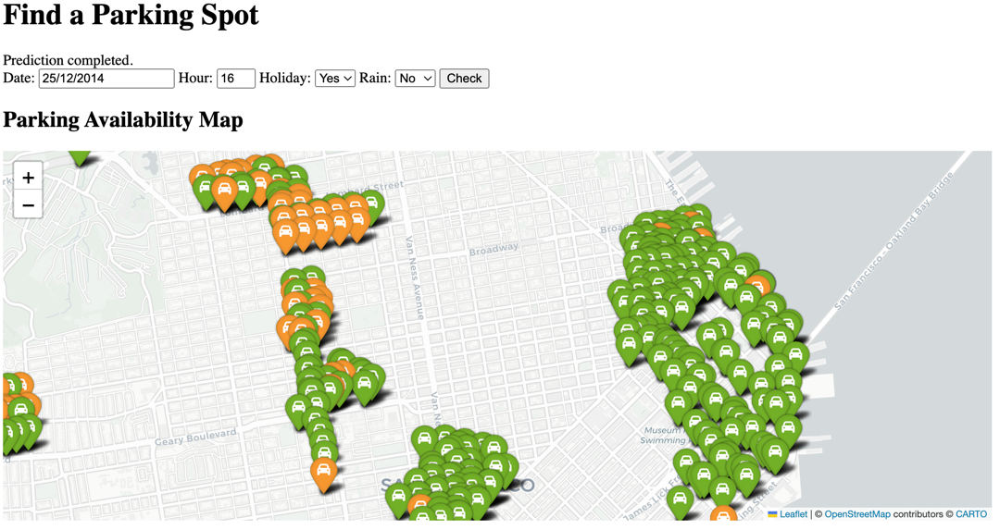

# Web Application Practice

This project is a practical exercise in migrating a lightweight Flask application to Django. The [original application](https://github.com/silentli/web_app_practice_archived/tree/main) was initially developed for exploring Flask and rapid prototyping for machine learning projects.  

## Project Main Structure
```plaintext
web_app/
├── predictor/
│   ├── __init__.py
│   └──	data/
│   	└──	street_sensor_longlat.csv
│   ├── migrations/
│   ├── model/
│   	└──	park_pycaret_2012_pipeline.pkl
│   ├── services/
│       ├── __init__.py
│       ├── data_handler.py
│       ├── map_visualizer.py
│   	└──	predictor.py
│   ├── templates/
│       └── predictor/
│   	    └──	index.html
│   ├── utils/
│       ├── __init__.py
│   	└──	loaders.py
│   ├── tests.py
│   └── views.py
├── web_app/
│   ├── __init__.py
│   ├── asgi.py
│   ├── settings.py
│   ├── urls.py
│   └── wsgi.py
├── manage.py
└── requirements.txt
```
- **predictor/**: Contains the core application logic, including services, views, and configurations.  

## Key Features
- **Form Handling**: The application includes an HTML page with form-handling capabilities.  
- **Machine Learning Integration**: The app is designed to integrate machine learning models into a web environment.  
- **Parking Availability Prediction**: Users can fill out a form with details such as date, time and other relevant parameters, and the dashboard generates predictions about parking availability.  
  
